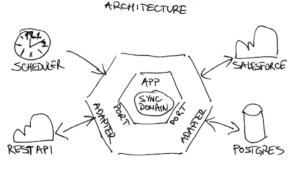
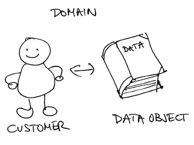
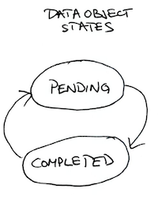

# Sync App 

Application for syncing Salesforce data objects.

## Architecture Overview

The intention of this architecture was to create loosely coupled module components that could be easily adjusted / replaced with a new ones.

### Hexagonal Architecture

Domain i.e. logic of the app is separated fromm its external dependencies by the means of ports and adapters. The idea here is to isolate the domain logic from the outside concerns. The biggest benefit that we could easily swap each component if necessary. The ports serve as the concrat for the primary (incoming i.e. **rest-api**, **scheduler**) and secondary (outbound i.e. **salesforce**, **postgres**) adapters.

    

### Domain

The domain consists of a customer and its data objects which we are syncing with Salesforce. Customer keeps track about sync status while the data object contains minimal information about the Salesforce object data.

    

### Data Object State

Between each sync cycle data object could be only in two states. 

- **PENDING** - object has been changed at Salesforce, and its details need to be fetched by the **sync-app**
- **COMPLETED** - object has been synced with Salesforce and it can be reached by clients thorough REST API

    

## Getting Started

These instructions will explain how to get a copy of the project up and running on your local machine for development and testing purposes.

### Prerequisites

In order to build the project you will have to have [Java 15+](http://www.oracle.com/technetwork/java/javase/downloads/index.html), [Docker](https://docs.docker.com/install/)
and [Docker Compose](https://docs.docker.com/compose/install/) installed on your machine.

You might already have some software already installed on you machine. To confirm it, please run the following commands
in your terminal window:

For Java:

    java --version

For Docker:

    docker --version

For Docker Compose:

    docker-compose --version 

### Installing and Running

Follow the steps below to quickly bring up the infrastructure.

> It is assumed that you've opened your terminal window and navigated to the directory of this document.

#### Start Postgres and Sync app

To start all the services run the following command from your terminal window:

    ./run.sh

This script will execute tests and package the sync-app, build the Docker image for the sync-app and Postgres and install them
in your local Docker image registry. All containers will then be run using **docker-compose**.

> **Important:**
>Make sure that you have the following ports available in your local machine: **8080** and **5432**. These are
>the ports used by **sync-app** and **Postgres**, respectively.

After you have run the `./run.sh` for the first time, all services will be containerized. Therefore, for every subsequent infrastructure bootstrap, it is sufficient to run **docker-compose**:

    docker-compose up

## Schedule customer for sync

After the app is up and running in order for sync process to start we need to add a new customer. To add sample customers from Salesforce Developer Account run the following command in your terminal window:

    ./create-customers.sh     

This script will call customer REST resource of the **sync-app** and create two customers which will then be picked up by the scheduler job, responsible for the syncing of customer's data objects. 

> **Note:**
>One of the sample customers has been populated with a test data (~2.5k data objects) hence API daily rate limit for this test customer might be reached.
>If that happens his data objects will be synced as soon the daily rate limit is reset.

## Running the tests

    ./gradlew clean test

## API Reference

REST API consists of customer and data object resources:

1. Customer

    In order to create new customer call:

        POST /customers

2. Data Object

    To fetch data object call:

        GET /salesforce/{id}

### Example API Calls

Example API calls for the customer and data object resource:

* To create a new customer:

  Request:

        curl -X POST 'http://localhost:8080/customers' \
        -H 'Content-Type: application/json' \
        -d '{
            "username": "{salesforce_account_username}",
            "clientId": "{salesforce_consumer_key_for_the_sync_app}"
        }'

  Response:

        Header:
            Status: 201 Created
            Location: /customers/{id}
        Body:

* To get data object content:

  Request:

        curl -X GET "http://localhost:8080/salesforce/{id}"

  Response:

        Header:
            Status: 200 OK
        Body:
            {
                "attributes": {
                    "type": "Account",
                    "url": "/services/data/v51.0/sobjects/Account/{id}"
                },
                "Id": "{id}",
                "IsDeleted": false,
                "MasterRecordId": null,
                "Name": "Some Test Company",
                "Type": "Customer - Direct",
                ...
            }

## Built With

* [Spring Boot](https://projects.spring.io/spring-boot/) - The application framework
* [Reactor](https://projectreactor.io/) - The reactive library
* [Gradle](https://gradle.org) - Build tool
* [Docker](https://docs.docker.com/install/) - Container packaging

